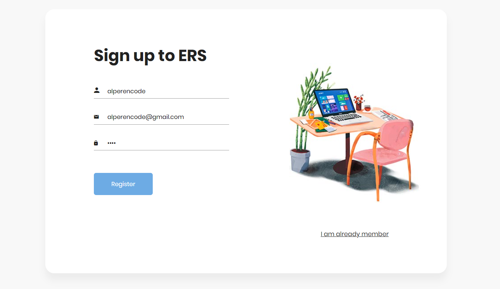
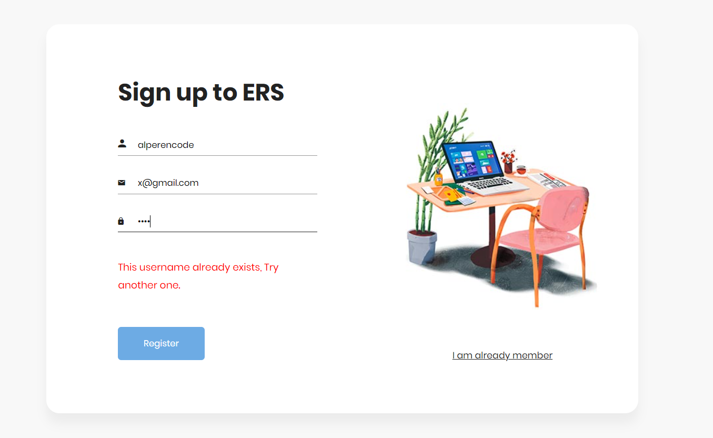
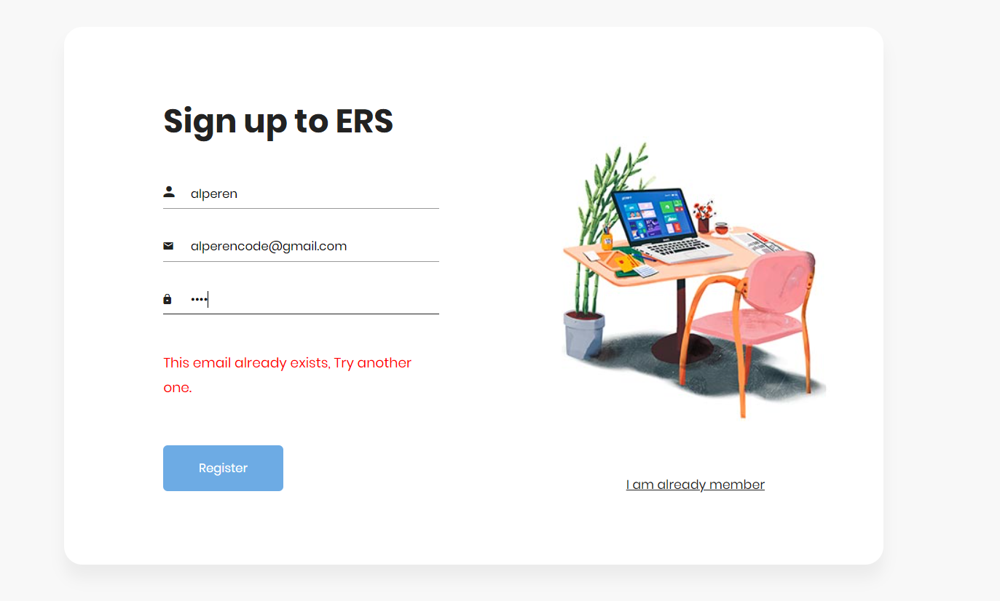

# Event Registration System (In Development)

## Overview

The Event Registration System is a web application being developed to provide a platform for event organizers to create and manage events, while allowing users to browse and register for these events. This README will provide an overview of the project, setup instructions, and initial considerations for development.

> [!NOTE] 
> This project is still in the development phase, and this README is intended as a starting point for the team.

## Table of Contents
- [Event Registration System (In Development)](#event-registration-system-in-development)
  - [Overview](#overview)
  - [Table of Contents](#table-of-contents)
  - [Features](#features)
  - [Getting Started](#getting-started)
  - [Sample Images](#sample-images)
  - [Contributing](#contributing)
  - [Issues and Bugs](#issues-and-bugs)
  - [License](#license)

## Features

- User authentication: Register and log in as a user or an event organizer.
- Event management: Create, edit, and manage events with details like name, date, time, location, description, and event type.
- Event registration: Users can register for events, and organizers can track attendees.
- Event categories: Categorize events for easy navigation.
- Event updates: Organizers can update event details or cancel events.
- Payment processing: Integrate a payment gateway for paid events.
- User profiles: Users can edit their profiles and upload a profile picture.
- Event listings: Display upcoming events with brief descriptions.
- Event details: Provide detailed information about each event.
- User dashboard: Show registered events and event notifications.
- Search and filter: Help users find events based on keywords, location, date, or event type.
- Admin panel: Admins can manage events, user accounts, and monitor event registrations.
- Security and user permissions: Ensure secure data storage and prevent unauthorized access.
- Responsive design: Ensure compatibility with various devices.

## Getting Started

These are the initial steps to get the project up and running on your local development environment:

1. **Prerequisites:**
   
- Install Java Development Kit (JDK) and Apache Tomcat on your system.

2. **Clone the Repository:**

- `git clone https://github.com/Alperencode/Event-Registration-System.git`

3. **Build and Run:**
- Build the project and deploy it to your Tomcat server.

4. **Access the Application:**
- Open a web browser and access the application at `http://localhost:8080/Event-Registration-System`.

## Sample Images

<h3> </h3>

## Contributing

This project is a collaborative effort. If you're part of the development team, follow these guidelines:

- Create a new branch for each feature or bug fix you're working on.
- Commit changes with descriptive messages.
- Push your changes to the repository.
- Create a pull request for code review and merging.

## Issues and Bugs

If you encounter issues or find bugs in the project, please report them using the GitHub issue tracker.

## Contributers

- Alperen Ağa
- Şimal Arifoğlu

## License

This project is licensed under the [MIT License](LICENSE).

> Note: This README serves as a starting point for the project documentation. It will be updated and expanded as the project evolves and new features are implemented.
