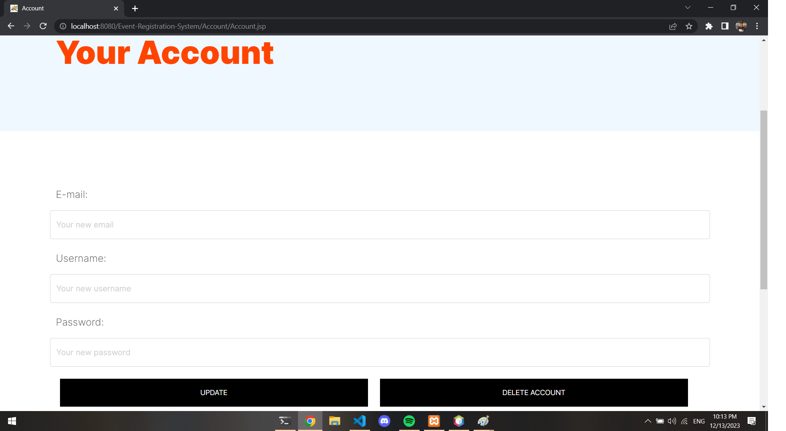

# Event Registration System (In Development)

## Overview

The Event Registration System is a JSP web application being developed to provide a platform for event organizers to create events, while allowing users to see and register for these events. This README will provide an overview of the project, setup instructions, and initial considerations for development.

## Table of Contents
- [Event Registration System (In Development)](#event-registration-system-in-development)
  - [Overview](#overview)
  - [Table of Contents](#table-of-contents)
  - [Features](#features)
  - [Getting Started](#getting-started)
  - [Sample Images](#sample-images)
  - [Contributing](#contributing)
  - [Issues and Bugs](#issues-and-bugs)
  - [Contributors](#contributors)
  - [License](#license)

## Features

- User authentication: Register and log in as a user or an event organizer.
- Cookies: Login page has Remember me button which allows users to keep signed-in for 24 hours.
- Account management: Edit your account details like name, email and password.
- Event management: Create and edit events with details like name, date, time, location and descriptions.
- Event registration: Users can register, save, leave and un-save the events.
- Event updates: Organizers can update event details or cancel events.
- Event listings: Display upcoming events with brief descriptions.
- Event details: Provide detailed information about each event.
- Security and user permissions: Ensure secure data storage and prevent unauthorized access.

## Getting Started

These are the initial steps to get the project up and running on your local development environment:

1. **Prerequisites:**
   
- Install Java Development Kit (JDK) and Apache Tomcat on your system.

2. **Clone the Repository:**

- `git clone https://github.com/Alperencode/Event-Registration-System.git`

3. **Build and Run:**
- Build the project and deploy it to your Tomcat server.

4. **Build the MySQL Database**
- Run the SQL queries from [Tables](Tables/) directory to create tables

5. **Access the Application:**
- Open a web browser and access the application at `http://localhost:8080/Event-Registration-System`.

## Sample Images

<h3> </h3>

## Contributing

This project is a collaborative effort. If you want to contribute to the project, follow these guidelines:

- Create a new branch for each feature or bug fix you're working on.
- Commit changes with descriptive messages.
- Push your changes to the repository.
- Create a pull request for code review and merging.

## Issues and Bugs

If you encounter issues or find bugs in the project, please report them using the GitHub issue tracker.

## Contributors

- [Alperen Ağa](https://github.com/alperencode)
- [Şimal Arifoğlu](https://github.com/simalarifoglu)

## License

This project is licensed under the [MIT License](LICENSE).